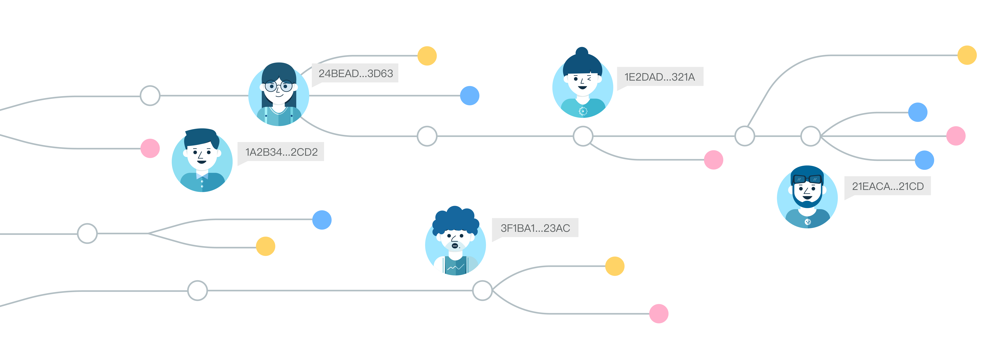
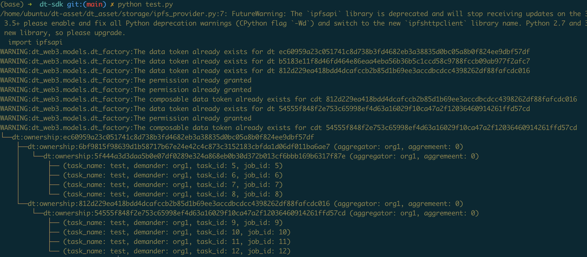

<h1 align="center">DataToken</h1>

## Overview
<div align="center">
 
</div>

[中文版](./README_CN.md)

This project implements a new decentralized data management and off-chain trusted computing middleware, DataToken SDK. It is developed by Ownership Labs and supported by the [LatticeX](https://github.com/LatticeX-Foundation) Foundation. Design philosophies can be found in the [grants](./docs/grants_cn.md) and [paper](./docs/white_paper.md). The SDK leverages the trusted features of blockchains to return data ownership to its owners while maintaining the computability of data.

### Motivation

Our vision is to make the data flows more transparent. To achieve it, we design a new data service specification for traceable computation and hierarchical aggregation. Data owners can declare a permitted list of trusted operators and related constraints in the data service terms. Data aggregators can define trusted, distributed computing workflows on multiple data assets, formalizing data in different domains into an aggregated data union. Data buyers can directly purchase aggregated datasets and confirm the origins of each data inside it.

Specifically, only when the pre-declared constraints are satisfied, assets will be authorized for aggregated computation. This process can be executed automatically without manually audits, ultimately enabling data assets to be defined once and sold multiple times. This design is consistent with the structure of real-world data flows, and the whole lifecycle of data sharing and utilization becomes more transparent, compliant and traceable.

### System Design

| Module                     | Description                                                                                     |
| -------------------------- | ----------------------------------------------------------------------------------------------- |
| [dt-contracts](https://github.com/ownership-labs/dt-contracts)            | smart contracts for data token                                          |
| [dt-web3](https://github.com/ownership-labs/dt-web3)            | entry point for accessing datatoken contracts                                          |
| [dt-asset](https://github.com/ownership-labs/dt-asset)             | off-chain asset descriptor using on-chain operators                                           |
| [dt-sdk](https://github.com/ownership-labs/DataToken/dt_sdk)           | decentralized access control for off-chain data sharing and monetization                                         |
| [rtt-tracer](https://github.com/ownership-labs/Compute-to-Data)            | traceable, privacy-preserving ML using data you cannot see |

## SDK Guides

### highlights

The dt-sdk implements several key services for data collaboration, including System module, Asset module, Job module, Tracer module and Verifier module. Different modules are designed for different participators:

- System administrators can manage asset providers and trusted operators that are registered in the blockchain by using the System module;
- Asset providers and aggregators can use the Asset module to publish datasets/computation/algorithms, and validate service agreements and then authorize the aggregation of data unions;
- Demanders and solvers can use the Job module to create tasks and submit solutions (e.g., off-chain data collaboration). Asset providers can also quickly verify remote execution;
- Regulatory parties can use the Tracer module to check the whole lifecycle of cross-domain data sharing and utilization, ensuring the user privacy and legality of data monetization. Also, the data traders can price data as assets based on their origins and historical market information.

The definition of data unions and trusted workflow service specification can be found in the [dt-asset](https://github.com/ownership-labs/dt-asset) repository.

### play with it

You first need to deploy dt-contracts to the Alaya private chain, refer to [Deployment Tutorial](https://github.com/ownership-labs/dt-contracts). We use the four predefined accounts for testing, and also set up the config.ini in the DataToken directory (e.g., artifacts_path and address_file).

Run the following commands:
```
$ git clone https://github.com/ownership-labs/DataToken
$ git clone https://github.com/ownership-labs/dt-contracts
$ git clone https://github.com/ownership-labs/dt-web3
$ git clone https://github.com/ownership-labs/dt-asset
$ cd DataToken
$ export PYTHONPATH=$PYTHONPATH:../dt-asset:../dt-web3:../DataToken
$ pip install -r requirements.txt
$ python tests/test.py
```

When you run it multiple times or modify the constraint parameters, the command line will print out the whole lifecycle of data sharing and utilization.
<div align="center">
 
</div>

### examples and tutorials

We provide several use cases, including cross-site data collaboration (between enterprizes) and edge federated learning (between users), see the [examples](. /examples). We also design a smart data grid for serving private machine learning of sensitive data assets, see the [Compute-to-Data](https://github.com/ownership-labs/Compute-to-Data). With DataToken combined, data owners can quickly define allowed AI services and the data grid will automatically verify the external data usage requests. Third-party scientists can start remote executions and get results on data they cannot see. In other words, data owners run the codes on-premise and thus monetize the computation rights of private data.