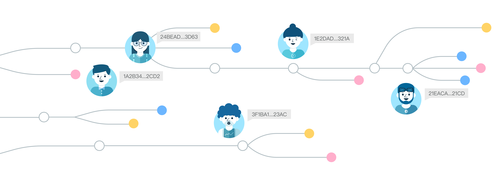

<h1 align="center">DataToken</h1>

## 概览
<div align="center">
 
</div>

[英文版](./README.md)

本项目为Ownership Labs开发的跨域分布式数据权限管理和链下可信计算中间件(DataToken SDK)，由[LatticeX](https://github.com/LatticeX-Foundation)基金会提供支持，细节可查阅[Grants](./docs/grants_cn.md)和[论文](./docs/white_paper.md)。该SDK利用了区块链的多方对等共识和信息不可篡改等可信特征，实现了数据归属确权、数据服务授权和数据计算追溯。

### 核心理念

项目旨在将数据流动的链条透明化，由此设计了可追溯计算、可层次化聚合的数据服务规范。资产方可在数据服务条款中声明可信操作的许可列表；聚合方可在多个不同域的数据资产和算力资产上定义可信的分布式计算工作流，形成数据联合体；数据买方可以直接购买聚合数据，并确认其中各数据的来源。

当满足资产预先声明的操作规范时，聚合计算才会被授权，且该过程可自动执行，无需人为地校验外部操作，最终实现(数据)资产一次发布、多次出售。这样的设计符合现实世界中的数据流动结构，数据共享计算的全生命周期将变得更透明合规且具有可追溯性。

### 系统组成

| 模块                     | 描述                                                                                     |
| -------------------------- | ----------------------------------------------------------------------------------------------- |
| [dt-contracts](https://github.com/ownership-labs/dt-contracts)            | 数据通证颁发、可信算子发布、任务市场等合约                                          |
| [dt-asset](https://github.com/ownership-labs/dt-asset)             | 资产元数据管理和跨域可信计算服务规范                                           |
| [DataToken](https://github.com/ownership-labs/DataToken)           | 为开发者提供DataToken在数据协作中的完整功能                                         |
| [Compute-to-Data](https://github.com/ownership-labs/Compute-to-Data)            | 面向远程资产的可追溯、隐私保护的机器学习 |

## SDK使用指南

### 功能特性

该仓库下封装了数据协作过程中的几个关键服务模块，包括系统管理模块、资产管理模块、任务工作模块、跨域追溯模块和服务验证模块。不同的业务角色可以使用不同的模块：

- 系统管理员可通过系统模块来管理链上的资产提供方和可信算子模版；
- 资产提供方和聚合方可通过资产模块来实现数据资产和数据联合体的发布、服务验证和授权聚合；
- 需求方和求解方可通过任务工作模块来完成任务发布和计算求解，资产方也可快速验证远程计算；
- 监管方可通过跨域追溯模块来确认资产的合理利用，交易方也可根据资产的来源和历史生命周期来定价。

关于数据联合体的定义和分布式可信计算的服务规范可参考[AuthComputa](https://github.com/ownership-labs/AuthComputa)仓库。

### 运行流程

在运行测试前，首先需要部署dt-contracts，参考[部署教程](https://github.com/ownership-labs/dt-contracts)。同时配置DataToken目录下的config.ini，包括artifacts_path和address_file。修改tests目录中测试文件的账户，例如ganache-cli提供的前四个私钥。

使用如下命令测试：
```
$ git clone https://github.com/ownership-labs/DataToken
$ git clone https://github.com/ownership-labs/dt-contracts
$ cd DataToken
$ export PYTHONPATH=$PYTHONPATH:../DataToken
$ pip install -r requirements.txt
$ python tests/test.py
```

当你运行地足够多次或修改其中的约束参数，命令行将打印出数据资产共享利用的全流程：
<div align="center">
 
</div>

### MVP用例

我们还提供了DataToken在实际场景中的用例，包括企业间数据协作和用户级边缘计算(查看[examples](./examples))。同时，我们针对隐私AI问题，设计了可追溯计算的私域数据服务网格，帮助资产方快速定义本地计算服务并自动校验外部计算请求，第三方科学家可在数据可用不可见的情况下完成远程的隐私AI计算，查看[Compute-to-Data](https://github.com/ownership-labs/Compute-to-Data)。