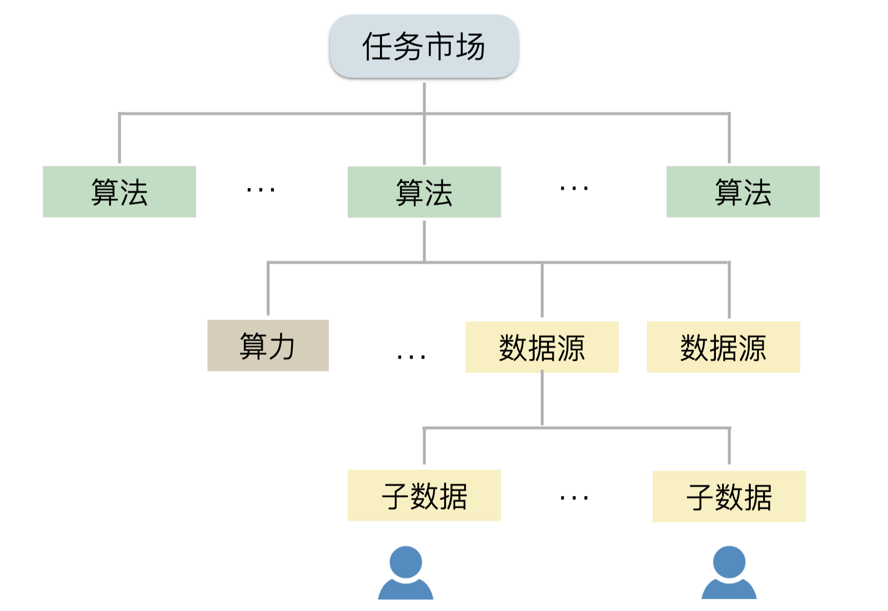
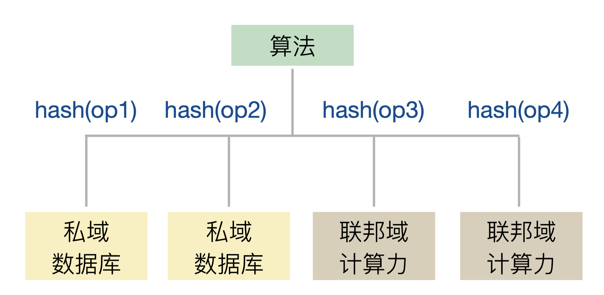

# DataToken

联系方式：qblee@zju.edu.cn

本项目为Ownership Labs团队开发的Compute-to-Data项目，入选了Platon的Grants计划项目。本项目将基于PlatON和Rosetta，实现一套跨域的分布式数据管理和远程计算中间件(DataToken SDK)，以确保数据共享利用的全流程可以被精准追踪和审计。

## 项目目标

随着大数据技术的高速发展，数据已然成为众多公司的重要资产和商业引擎。但数据流通存在壁垒，传统的IT技术栈无法同时满足数据跨域计算、用户隐私保护和数据监管审计三者。而区块链的多方对等共识、信息不可篡改等特性， 使其在数据确权、数据授权、数据溯源等方面有巨大的应用潜力。为了实现数据资产不出私域下的安全可信流动，本项目将基于区块链和密码学，实现一套跨域的分布式数据管理和远程计算中间件(DataToken)，并确保数据共享利用的全流程可以被精准追踪和审计。

## 项目价值

当前业务部门间、机构间相互隔离，跨域数据共享难的原因在于，一旦数据资产离开私域，将面临第三方的数据沉淀收集甚至转卖等风险，难以保证所有者的核心利益。同时，数据集中通常包含了许多用户数据，监管机构对规范用户数据共享的要求正日益增长，用户隐私保护和数据主权的法规也正在不断设立。当前的隐私计算方案实现了原始数据不出私域下的多方数据协作，但并未确保私域数据的融合计算经过严格的权限管理，难以满足监管对数据应用主体和数据托管主体的合规要求，同时用户仍不具备其数据使用全流程的知情权。

本项目将提供简单易用的跨域数据融合计算SDK，实现数据不动、算法动的分布式计算服务规范(compute-to-data)。在企业/用户完全控制其数据资产的前提下，允许数据需求方将可信的远程算法发送到数据侧进行本地计算，同时确保数据操作全流程可追踪可审计。数据所有主体将“预先”获知其数据资产将被谁、被如何处理分发，从而对数据的本地计算权进行自主授权，数据应用主体也可以更合规地利用跨域数据资产来进行数据协同分析。

不同于Ocean Protocol的面向单域数据的远程计算方案，本项目提出的DataToken SDK 可以在多个数据源(及其用户子数据)和多个算力上定义可信的分布式计算工作流，能够追踪数据跨域融合计算的全过程。相信只有通过可信全面的数据共享使用信息，市场的价格发现机制才能为数据进行合理的定价，从而构建万亿美元数据市场。

## 核心原理

### 问题描述
在本项目的设定中，一个多方数据协作任务的参与主体包括数据源方、算力提供方、算法提供方和数据应用方。联合计算问题通常可以用下图的嵌套结构来表示：一个数据源可由多个子数据源构成，一个远程算法可应用在多个数据源和多个计算力上，一个任务也可以由多个算法阶段构成。

<div align="center">
 
</div>

数据、算力、算法等都可以被理解为资产，用数据Token(DataToken, DT)来进行唯一标识，不同资产具有不同的元信息(metadata)，用分布式文档对象DDO来表示。链上维护了一份DT注册表，可以快速定位链下DDO的IPFS存储位置：

```
DT标识符在链上注册为：{DT, owner_address, storage_path, proof}
DDO在链下存储为：{DT，proof，services: [type, endpoint, child_dts, supported_ops, workflows, extra_params]}
```

其中proof=hash(metadata)，type区分数据、算力、算法资源，endpoint为服务端点，extra_params里可包含名称、描述、提供方、价格等信息。child_dts=[{0: dt_0}, {1: dt_1}, ..., {n: dt_n}]，为空则表示底层资源。一个企业数据源DDO可以用这样的结构来表示，其中包含多个用户数据构成的DT列表。

### 远程计算规范

为了实现跨域的分布式计算，资产DDO的数据结构不仅包含多个子DT标识符，还应包含对这些资源的操作代码哈希。以两家银⾏联合建模为例，第三⽅科技公司提供算法：

<div align="center">
 
</div>

其中，op_1、op_2为秘密共享操作，op_3、op_4为SS碎片上的联合AI操作。算法DDO中包含了对四个资源的工作流存证，表示私域数据库中的原始数据经过秘密共享后，发送到联邦域算力上进行联合建模。

例如金融科技公司C为两家银行A、B提供客户画像和联合风控服务。假设银行的原始客户数据位于私域网络的数据库中，可以通过秘密共享SS将客户数据加密传递到银行间的联邦域网络，在密文基础上进行MPC联合建模。

资产所有者应能快速设置DDO中的远程计算规范，如支持的操作、分布式工作流等，为此首先要规范化操作代码，形成一系列可信的远程代码模版。操作代码也可以用其哈希来唯一标识并上链，代码脚本存储在IPFS当中，这个步骤可以由系统管理员来执行。这样，DDO中的supported_ops和workflows就可以用统一的代码标识符来进行配置：

```
supported_ops: [{0:op_0},...,{m:op_m}]
workflows: [set_ops:[{0:dt_0_op},...,{n:dt_n_op}],configs]
```

当child_dts列表为空时，workflows也应该为空。此时supported_ops表示该底层资产支持的本地代码操作(的链上标识符集合)，例如支持联邦学习的移动端用户数据。当child_dts列表不为空时，supported_ops表示该资产的所有子dt一致支持的操作；同时可在workflow中定义更为复杂的分布式工作流，set_ops中包含了对各个子dt的具体操作，configs中可附带运行参数或指明工作流的计算顺序。

### 任务工作市场
高层资产在执行实际计算前，需要获取低层资产的使用授权。而低层资产通常会验证高层资产DDO中的操作代码是否符合自己的支持条款，满足即在链上授权。在复杂的实际问题中，可以使用层次化的代理结构，例如，dt_1授权给dt_2，dt_2授权给dt_3，可以认为dt_3所有者获取了dt_1资产的本地操作权限。通过这种方式，算法提供方可以在企业数据源下的用户数据本地执行计算。

值得一提的是，在多方数据协作任务中，获取授权不意味着可以立即发起远程计算，否则低层资产无法追踪其全流程使用情况，只有所有参与方都授权后才可执行实际计算。我们设计了一个链上的任务工作市场，作为算法DT的终止状态，当一可信机构将该DT存证到任务工作中后，意味着有人为该远程计算担保，并已取得所有授权。低层资产也可以获知其将如何被使用、以及被谁使用(具体操作是，在链上查询自己是否授权过该算法DT或其子DT的...的子DT)。

## MVP交互流程
DataToken SDK允许在分布式资源上进行可信可追溯的计算，并将提供三个场景MVP：1）企业间数据协作；2）用户级边缘计算；3）可追溯的隐私AI。

### 企业间数据协作

考虑简单的两方纵向联邦学习，例如金融科技公司C为两家银行A、B提供联合风控服务。假设银行的原始客户数据位于私域网络的数据库中(安全性等级高)，在保证数据安全且操作可审计的情况下，可以通过密码学方案(如秘密共享SS)将客户数据加密传递到银行间的联邦域网络(安全性等级稍低)，在密文基础上进一步实现MPC联合建模。在这里，银行A、B同时作为数据源方和算力提供方，金融科技公司C则是算法提供方和数据应用方。MVP流程如下：

1. 合约部署方为系统管理员，添加A、B、C的机构名和账户关系，同时将SS和MPC代码哈希注册到链上，脚本存储在IPFS中；
2. 银行A、B用DT/DDO描述私域数据和联邦域算力的服务条款，前者应支持SS操作，后者应支持MPC操作，生成四个dt标识符和四个ddo。将ddo存储在IPFS中，将dt、storage_path和proof注册到链上；
3. 公司C对数据/算力DT进行组合，填充child_dts以及对各资源的代码哈希，生成算法dt后存IPFS并上链；
4. 银行A、B分别验证算法dt是否满足资源使用条款，验证通过后，在链上将数据/算力dt授权给算法dt；
5. 公司C在链上任务市场新建一个任务，并将算法dt提交到该任务的工作下；
6. 公司C远程操作银行A、B的数据/算力。各银行需要核实该算法dt是否取得授权、所有者签名、任务工作状态等。通过的话，从IPFS下载代码脚本，并执行本地计算。

### 用户级边缘计算
考虑简单的移动端横向联邦学习，例如智慧医疗公司B希望在穿戴式设备提供商A的所有用户数据上进行心脏病预测模型训练。用户数据都在移动设备本地，用u_1,u_2,...,u_n表示。在这里，提供商A是数据源方，包含了诸多用户数据，公司B则是算法提供方和数据应用方。计算过程都在数据私域完成，没有显示的算力提供方，即设备商A运行梯度聚合(如FedAverage)，用户设备运行横向模型计算(EdgeComp)。MVP流程如下：

1. 合约部署方为系统管理员，添加A、B的机构名和账户关系，同时将EdgeComp和FedAverage代码哈希注册到链上，脚本存储在IPFS中；
2. 设备商A为其生态用户添加身份，设置一个链上用户注册表，用于控制资产发布；
3. n个用户和设备商B都注册数据资产。用户ddo中应支持EdgeComp操作，设备商DDO中应对n个用户dt进行组合，并定义工作流, workflows=[set_ops:[{0:ec},...,{n:ec},{n+1(self):fa}]]，即在用户设备上运行横向模型，在设备商的私域聚合梯度；
4. 医疗公司B注册算法资产，其中包含设备商dt，并定义工作流，workflows=[set_ops:[{0:self}]]，表示该算法直接使用数据源B的工作流；
5. 用户验证设备商的数据源dt，设备商A则验证算法dt，均判断满足资源使用条款后，在链上完成dt间的授权关系；
6. 医疗公司B在链上任务市场新建一个任务，并将算法dt提交到该任务的工作下；
7. 医疗公司B向设备商A发起远程操作请求。设备商A核实算法，通过的话，首先告知所有用户，随后运行FedAverage；
8. 用户接收设备商A的消息，具有数据利用的知情权(可根据链上的任务工作市场和dt授权关系信息进行追溯)，随后运行EdgeComp。

在以上的过程中，设备商A和医疗公司B都不接触到原始的用户数据，只拿到中间数据或结果数据。各方都知道自己的资源被如何使用，用户也在确认授权后才执行本地计算。

### 可追溯计算的隐私AI
本项目在Rosetta基础上实现可追溯计算的隐私AI，rtt-tracer。该MVP将结合DataToken组件进行开发，实现安全多方计算下的联合模型。除了DT全功能外，还涉及简单的资产服务部署和联合计算功能：

1. 基于rtt的联合模型，提供用户信用违约等样例，在链上注册为可信OP模版；
2. 基于flask来部署资产服务，包括私域数据的本地计算和联邦域算力的代理计算。

在这个过程中，数据应用方会向多个资产方的flask服务发送实际的授权请求和远程计算请求。资产方验证请求后，下载可信rtt代码进行本地计算或联合计算。监管机构也可以查询资产使用情况。

### 里程碑与展望
完整的项目将基于Platon区块链和Rosetta隐私计算框架，涉及dt-contracts、dt-web3、dt-asset、dt-sdk、rtt-tracer等5个代码仓库。关键里程碑可以分为M1-M4几个阶段：

- M1—链上合约(dt-contracts)和链下交互过程(dt-web3)：前者主要包括管理员和机构注册、DT上链和授权、可信OP注册、任务工作市场；后者主要包括迁移Ocean的keeper-py-lib、链上合约对应的链下实例类
- M2—链下元数据管理和计算协议工具集(dt-asset)：主要包括DT标识符生成、DDO元数据管理、创建计算服务工作流、IPFS存储连接器
- M3—多方数据协作的业务层开发工具(dt-sdk)：主要包括几个业务参与方的功能封装，即系统管理员、数据提供方、算力提供方、算法提供方，同时完成MVP1和MVP2
- M4，可追溯计算的隐私AI(rtt-tracer)：完成MVP3

总结来说，该项目更多是对多方数据协作的全流程进行资产化上链。后续将跟Rosetta进行深度绑定，形成一系列可信的分布式计算OP模版，并提供一站式多方数据协作门户平台，用可视化的交互界面来进行数据协作和数据追溯。


